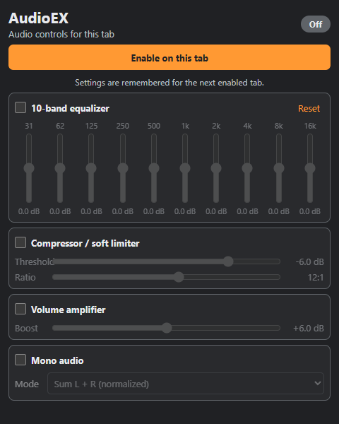

#  AudioEX

AudioEX is a small Chrome extension for changing the audio of individual tabs. It uses Chrome's tab capture and Web Audio APIs, and all processing stays inside the browser.



## Features

- 10-band equalizer with ±12 dB per band
- Compressor / soft limiter with threshold, ratio, and up to +24 dB of makeup gain
- Volume amplifier with up to +12 dB of boost
- Mono routing with three modes:
  - Copy left to right
  - Copy right to left
  - Sum left and right to both channels
- Independent enable switch for every processor
- Drag-and-drop processor ordering with keyboard reordering
- Per-tab capture with settings remembered for the next tab
- Multiple captured tabs at the same time

The mono sum is normalized as `(L + R) / 2` to preserve headroom.

## Install

AudioEX requires Chrome 116 or newer.

1. Clone this repository or download and extract its source.
2. Open `chrome://extensions` in Chrome.
3. Turn on **Developer mode**.
4. Select **Load unpacked**.
5. Choose the repository folder containing `manifest.json`.
6. Pin AudioEX from Chrome's extensions menu if desired.

## Use

1. Open a tab that is playing audio.
2. Open AudioEX and select **Enable on this tab**.
3. Enable and adjust any processors.
4. Close the popup. Processing continues until the tab is closed, capture ends, or **Disable on this tab** is selected.

The toolbar badge reads `ON` while a tab is being processed. Each newly captured tab requires an explicit click. Chrome internal pages cannot be captured, and reloading or updating the extension ends active captures.

## Audio chain

```text
Captured tab
  -> 10-band EQ
  -> stereo / mono routing matrix
  -> volume amplifier
  -> compressor / matched bypass + makeup gain
  -> browser audio output
```

This is the default order. Drag any processor by its left handle to change the live signal path; the order is remembered with the other settings.

Chrome stops the tab's original local playback while it is captured. AudioEX reconnects the processed signal to the browser output, including when every processor is bypassed.

The compressor uses the browser's `DynamicsCompressorNode`. It behaves as a soft limiter, not a guaranteed brick-wall limiter. Its bypass path has a matching 6 ms delay so enabling it does not change timing, and makeup gain applies only to the compressed path.

## Privacy

AudioEX has no analytics, network requests, content scripts, or host permissions. Captured audio is processed locally and is never saved or transmitted.

## Development

The extension uses browser-native JavaScript modules and has no runtime or development dependencies.

```powershell
npm run check
```

This runs syntax checks, Node unit tests, manifest checks, and real Web Audio tests in headless Chrome. Set `CHROME_PATH` if Chrome or Chromium is installed somewhere unusual.

The Windows fullscreen regression test is headed and changes the test browser's window state briefly:

```powershell
npm run test:fullscreen
```

## License

Copyright (C) 2026 vorvek.

AudioEX is licensed under the [GNU General Public License v3.0 only](LICENSE) (`GPL-3.0-only`).
